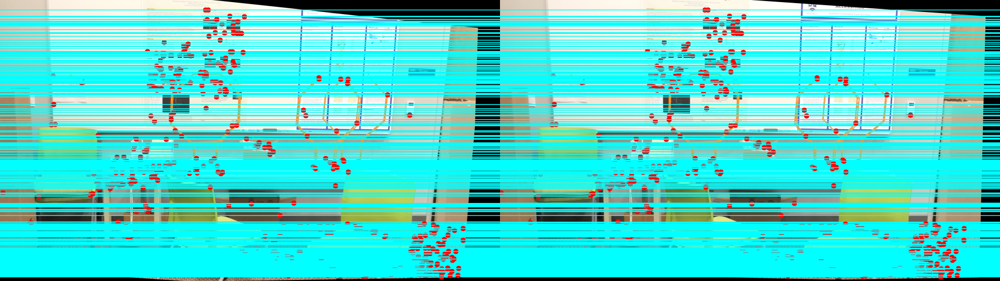

Computer Vision
====================================

.. contents:: Table of Contents
   :local:

------------

Data Fitting 
************************************************
Data fitting with Least Square, Total Least Square, and RANSAC

.. grid:: 1 1 3 3

   .. grid-item::

      - Least Square

      .. image:: cv/data_fitting_ls.png

   .. grid-item::

      - Total Least Square

      .. image:: cv/data_fitting_tls.png

   .. grid-item::

      - RANSAC

      .. image:: cv/data_fitting_ransac.png

See `report  <https://github.com/longhongc/ENPM673-computer-vision-hw/blob/main/hw1/ENPM673_Homework1_Report.pdf>`__ for details

AR Tag Decoding 
************************************************

.. grid:: 1 1 3 3

   .. grid-item::
      
      1. Original image

      .. image:: cv/ar_tag_decode_1.jpg

   .. grid-item::

      2. Threshold

      .. image:: cv/ar_tag_decode_2.jpg

   .. grid-item::

      3. Canny edge finding

      .. image:: cv/ar_tag_decode_3.jpg

.. grid:: 1 1 3 3

   .. grid-item::

      4. Shi-Tomasi Corner Detector

      .. image:: cv/ar_tag_decode_4.jpg

   .. grid-item::

      5. Find vertics

      .. image:: cv/ar_tag_decode_5.jpg

   .. grid-item::

      6. Find AR tag corners

      .. image:: cv/ar_tag_decode_6.jpg

.. grid:: 1 1 3 3

   .. grid-item::

      7. Homography transform to straight pose

      .. image:: cv/ar_tag_decode_9.jpg
         :width: 60%

   .. grid-item::

      8. Transform to array and decode tag

      .. image:: cv/ar_tag_decode_10.png
         :width: 80%

See `report <https://github.com/longhongc/ENPM673-computer-vision-hw/blob/main/project1/ENPM673_Project1.pdf>`__ for details

Histogram Equalization 
************************************************

.. grid:: 1 1 2 2

   .. grid-item::

      - Original image

      .. image:: cv/histogram_before.jpg

   .. grid-item::

      - After historgram equalization

      .. image:: cv/histogram_after.jpg

See `report <https://github.com/longhongc/ENPM673-computer-vision-hw/blob/main/project2/ENPM673_Project2.pdf>`__ for details

K-means 
************************************************

.. grid:: 1 1 2 2

   .. grid-item::

      - Original image

      .. image:: cv/kmeans_before.png
         :width: 50%

   .. grid-item::

      - K-means after 50 iterations

      .. image:: cv/kmeans_after.jpg
         :width: 50%

See `report <https://github.com/longhongc/ENPM673-computer-vision-hw/blob/main/midterm/ENPM673_Midterm.pdf>`__ for details

Image Stiching
************************************************

.. grid:: 1 1 3 3

   .. grid-item::

      - Image A

      .. image:: cv/image_stitching_A.png

   .. grid-item::

      - Image B

      .. image:: cv/image_stictching_B.png

   .. grid-item::

      - Stitched image

      .. image:: cv/image_stitching_stitched_image.jpg

.. grid:: 1 1 2 2

   .. grid-item::

      - Matching points

      .. image:: cv/image_stitching_match_points.jpg

See `report <https://github.com/longhongc/ENPM673-computer-vision-hw/blob/main/midterm/ENPM673_Midterm.pdf>`__ for details

Car Lane Detection
************************************************

.. image:: cv/car_lane_detection.gif

See `report <https://github.com/longhongc/ENPM673-computer-vision-hw/blob/main/project2/ENPM673_Project2.pdf>`__ for details

Stereo Depth Iamge
************************************************

.. grid:: 1 1 3 3

   .. grid-item::

      - Stereo image left

      .. image:: cv/stereo_image_left.png

   .. grid-item::

      - Stereo image right

      .. image:: cv/stereo_image_right.png

- Epipolar line after rectification

.. grid:: 1 1 4 4

   .. grid-item::

      - Disparity image

      .. image:: cv/stereo_disparity_image.png

   .. grid-item::

      - Disparity heatmap

      .. image:: cv/stereo_disparity_heatmap.png

   .. grid-item::

      - Depth image

      .. image:: cv/stereo_depth_image.png

   .. grid-item::

      - Depth heatmap

      .. image:: cv/stereo_depth_heatmap.png

See `report <https://github.com/longhongc/ENPM673-computer-vision-hw/blob/main/project3/ENPM673_Project3.pdf>`__ for details
